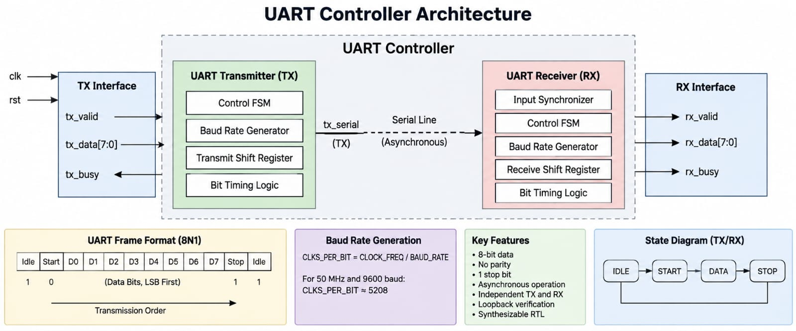

# UART Controller - SystemVerilog

## Overview

A configurable UART controller implemented in SystemVerilog RTL for asynchronous serial communication.

The design includes independent transmit and receive datapaths with configurable clock and baud-rate parameters.

## Specifications

| Parameter | Value |
|---|---|
| Clock Frequency | 50 MHz |
| Baud Rate | 9600 |
| Data Width | 8 bits |
| Start Bits | 1 |
| Stop Bits | 1 |
| Parity | None |
| Bit Order | LSB First |

## Architecture

The controller consists of independent UART transmitter and receiver blocks.

The transmitter serializes parallel data, while the receiver synchronizes and reconstructs incoming serial data.



## RTL Implementation

### UART Transmitter

- Configurable clock and baud rate
- Start-bit generation
- 8-bit LSB-first transmission
- Stop-bit generation
- `tx_busy` status indication
- Synchronous reset

### UART Receiver

- Two-stage RX input synchronization
- Start-bit detection
- Mid-bit start validation
- 8-bit LSB-first data sampling
- Stop-bit handling
- `rx_valid` data indication
- Synchronous reset

## Verification

The design is verified using SystemVerilog self-checking testbenches.

| Verification | Result |
|---|---|
| TX single-byte transmission | PASS |
| TX multi-byte transmission | PASS |
| TX reset behavior | PASS |
| RX data reception | PASS |
| TX/RX loopback | PASS |
| Functional coverage | 100% |

### Verified Data Patterns

```text
0x00
0x41
0x55
0xAA
0xFF